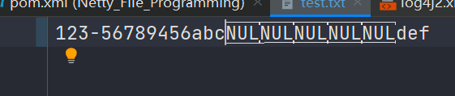

## 文件编程

### FileChannel

FileChannel 只能工作在阻塞模式下


#### 获取

不能直接打开 FileChannel，必须通过 FileInputStream、FileOutputStream 或者 RandomAccessFile 来获取 FileChannel，它们都有 getChannel 方法

* 通过 FileInputStream 获取的 channel 只能读
* 通过 FileOutputStream 获取的 channel 只能写
* 通过 RandomAccessFile 是否能读写根据构造 RandomAccessFile 时的读写模式决定


```java
package mao.t1;

import mao.utils.ByteBufferUtil;
import org.slf4j.Logger;
import org.slf4j.LoggerFactory;

import java.io.FileInputStream;
import java.io.FileOutputStream;
import java.io.RandomAccessFile;
import java.nio.ByteBuffer;
import java.nio.channels.FileChannel;
import java.nio.charset.StandardCharsets;

/**
 * Project name(项目名称)：Netty_File_Programming
 * Package(包名): mao.t1
 * Class(类名): FileChannelGetTest
 * Author(作者）: mao
 * Author QQ：1296193245
 * GitHub：https://github.com/maomao124/
 * Date(创建日期)： 2023/3/8
 * Time(创建时间)： 22:10
 * Version(版本): 1.0
 * Description(描述)： 得到FileChannel
 */

public class FileChannelGetTest
{
    /**
     * 日志
     */
    private static final Logger log = LoggerFactory.getLogger(FileChannelGetTest.class);

    /**
     * main方法
     *
     * @param args 参数
     */
    public static void main(String[] args)
    {
        //第一种方法，通过 FileInputStream 获取
        try (FileInputStream fileInputStream = new FileInputStream("test.txt"))
        {
            FileChannel fileChannel = fileInputStream.getChannel();
            log.debug(fileChannel.toString());
            //尝试读
            ByteBuffer byteBuffer = ByteBuffer.allocate(10);
            fileChannel.read(byteBuffer);
            byteBuffer.flip();
            byte b = byteBuffer.get(2);
            log.debug(String.valueOf((char) b));
            //打印
            ByteBufferUtil.debugAll(byteBuffer);

            //尝试写
            byteBuffer.clear();
            byteBuffer.put("abc".getBytes(StandardCharsets.UTF_8));
            //打印
            ByteBufferUtil.debugAll(byteBuffer);
            try
            {
                fileChannel.write(byteBuffer);
            }
            catch (Exception e)
            {
                log.error("写入失败：", e);
            }
        }
        catch (Exception e)
        {
            e.printStackTrace();
        }


        //第二种方法，通过 FileOutputStream 获取
        try (FileOutputStream fileOutputStream = new FileOutputStream("test.txt"))
        {
            FileChannel fileChannel = fileOutputStream.getChannel();
            log.debug(fileChannel.toString());
            //尝试读
            ByteBuffer byteBuffer = ByteBuffer.allocate(10);
            try
            {
                fileChannel.read(byteBuffer);
                byteBuffer.flip();
                byte b = byteBuffer.get(2);
                log.debug(String.valueOf((char) b));
                //打印
                ByteBufferUtil.debugAll(byteBuffer);
            }
            catch (Exception e)
            {
                log.error("读失败：", e);
            }

            //尝试写
            byteBuffer.clear();
            byteBuffer.put("abc".getBytes(StandardCharsets.UTF_8));
            //打印
            ByteBufferUtil.debugAll(byteBuffer);
            try
            {
                //切换读模式
                byteBuffer.flip();
                fileChannel.write(byteBuffer);
            }
            catch (Exception e)
            {
                log.error("写入失败：", e);
            }
        }
        catch (Exception e)
        {
            e.printStackTrace();
        }


       //第三种方法，通过 FileInputStream 获取
        try (RandomAccessFile randomAccessFile = new RandomAccessFile("test.txt","rw"))
        {
            FileChannel fileChannel = randomAccessFile.getChannel();
            log.debug(fileChannel.toString());
            //尝试读
            ByteBuffer byteBuffer = ByteBuffer.allocate(10);
            try
            {
                fileChannel.read(byteBuffer);
                byteBuffer.flip();
                byte b = byteBuffer.get(2);
                log.debug(String.valueOf((char) b));
                //打印
                ByteBufferUtil.debugAll(byteBuffer);
            }
            catch (Exception e)
            {
                log.error("读失败：", e);
            }

            //尝试写
            byteBuffer.clear();
            byteBuffer.put("abcdefg".getBytes(StandardCharsets.UTF_8));
            //打印
            ByteBufferUtil.debugAll(byteBuffer);
            try
            {
                //切换读模式
                byteBuffer.flip();
                fileChannel.write(byteBuffer);
            }
            catch (Exception e)
            {
                log.error("写入失败：", e);
            }
        }
        catch (Exception e)
        {
            e.printStackTrace();
        }
    }
}
```


运行结果：

```sh
2023-03-08  22:36:45.992  [main] DEBUG mao.t1.FileChannelGetTest:  sun.nio.ch.FileChannelImpl@22ef9844
2023-03-08  22:36:45.993  [main] DEBUG mao.t1.FileChannelGetTest:  3
2023-03-08  22:36:45.995  [main] DEBUG io.netty.util.internal.logging.InternalLoggerFactory:  Using SLF4J as the default logging framework
+--------+-------------------- all ------------------------+----------------+
position: [0], limit: [8]
         +-------------------------------------------------+
         |  0  1  2  3  4  5  6  7  8  9  a  b  c  d  e  f |
+--------+-------------------------------------------------+----------------+
|00000000| 31 32 33 34 35 36 0d 0a 00 00                   |123456....      |
+--------+-------------------------------------------------+----------------+
+--------+-------------------- all ------------------------+----------------+
position: [3], limit: [10]
         +-------------------------------------------------+
         |  0  1  2  3  4  5  6  7  8  9  a  b  c  d  e  f |
+--------+-------------------------------------------------+----------------+
|00000000| 61 62 63 34 35 36 0d 0a 00 00                   |abc456....      |
+--------+-------------------------------------------------+----------------+
2023-03-08  22:36:45.999  [main] ERROR mao.t1.FileChannelGetTest:  写入失败：
java.nio.channels.NonWritableChannelException: null
	at sun.nio.ch.FileChannelImpl.write(FileChannelImpl.java:273) ~[?:?]
	at mao.t1.FileChannelGetTest.main(FileChannelGetTest.java:62) [classes/:?]
2023-03-08  22:36:46.007  [main] DEBUG mao.t1.FileChannelGetTest:  sun.nio.ch.FileChannelImpl@73e9cf30
2023-03-08  22:36:46.007  [main] ERROR mao.t1.FileChannelGetTest:  读失败：
java.nio.channels.NonReadableChannelException: null
	at sun.nio.ch.FileChannelImpl.read(FileChannelImpl.java:217) ~[?:?]
	at mao.t1.FileChannelGetTest.main(FileChannelGetTest.java:86) [classes/:?]
+--------+-------------------- all ------------------------+----------------+
position: [3], limit: [10]
         +-------------------------------------------------+
         |  0  1  2  3  4  5  6  7  8  9  a  b  c  d  e  f |
+--------+-------------------------------------------------+----------------+
|00000000| 61 62 63 00 00 00 00 00 00 00                   |abc.......      |
+--------+-------------------------------------------------+----------------+
2023-03-08  22:36:46.007  [main] DEBUG mao.t1.FileChannelGetTest:  sun.nio.ch.FileChannelImpl@242b836
2023-03-08  22:36:46.008  [main] DEBUG mao.t1.FileChannelGetTest:  c
+--------+-------------------- all ------------------------+----------------+
position: [0], limit: [3]
         +-------------------------------------------------+
         |  0  1  2  3  4  5  6  7  8  9  a  b  c  d  e  f |
+--------+-------------------------------------------------+----------------+
|00000000| 61 62 63 00 00 00 00 00 00 00                   |abc.......      |
+--------+-------------------------------------------------+----------------+
+--------+-------------------- all ------------------------+----------------+
position: [7], limit: [10]
         +-------------------------------------------------+
         |  0  1  2  3  4  5  6  7  8  9  a  b  c  d  e  f |
+--------+-------------------------------------------------+----------------+
|00000000| 61 62 63 64 65 66 67 00 00 00                   |abcdefg...      |
+--------+-------------------------------------------------+----------------+
```


#### 读取

会从 channel 读取数据填充 ByteBuffer，返回值表示读到了多少字节，-1 表示到达了文件的末尾


```java
package mao.t1;

import mao.utils.ByteBufferUtil;
import org.slf4j.Logger;
import org.slf4j.LoggerFactory;

import java.io.RandomAccessFile;
import java.nio.ByteBuffer;
import java.nio.channels.FileChannel;

/**
 * Project name(项目名称)：Netty_File_Programming
 * Package(包名): mao.t1
 * Class(类名): FileChannelReadTest
 * Author(作者）: mao
 * Author QQ：1296193245
 * GitHub：https://github.com/maomao124/
 * Date(创建日期)： 2023/3/8
 * Time(创建时间)： 22:39
 * Version(版本): 1.0
 * Description(描述)： FileChannel读
 */

public class FileChannelReadTest
{
    /**
     * 日志
     */
    private static final Logger log = LoggerFactory.getLogger(FileChannelReadTest.class);


    public static void main(String[] args)
    {
        try (RandomAccessFile randomAccessFile = new RandomAccessFile("test.txt", "rw"))
        {
            FileChannel fileChannel = randomAccessFile.getChannel();
            ByteBuffer byteBuffer = ByteBuffer.allocate(16);
            //读
            int length = fileChannel.read(byteBuffer);
            log.debug("长度：" + length);
            ByteBufferUtil.debugAll(byteBuffer);
            length = fileChannel.read(byteBuffer);
            log.debug("长度：" + length);
        }
        catch (Exception e)
        {
            e.printStackTrace();
        }
    }
}
```


运行结果：

```sh
2023-03-10  22:51:57.481  [main] DEBUG mao.t1.FileChannelReadTest:  长度：10
2023-03-10  22:51:57.484  [main] DEBUG io.netty.util.internal.logging.InternalLoggerFactory:  Using SLF4J as the default logging framework
+--------+-------------------- all ------------------------+----------------+
position: [10], limit: [16]
         +-------------------------------------------------+
         |  0  1  2  3  4  5  6  7  8  9  a  b  c  d  e  f |
+--------+-------------------------------------------------+----------------+
|00000000| 61 62 63 61 62 63 64 65 66 67 00 00 00 00 00 00 |abcabcdefg......|
+--------+-------------------------------------------------+----------------+
2023-03-10  22:51:57.490  [main] DEBUG mao.t1.FileChannelReadTest:  长度：-1
```


#### 写入

```java
package mao.t1;

import mao.utils.ByteBufferUtil;
import org.slf4j.Logger;
import org.slf4j.LoggerFactory;

import java.io.RandomAccessFile;
import java.nio.ByteBuffer;
import java.nio.channels.FileChannel;
import java.nio.charset.StandardCharsets;

/**
 * Project name(项目名称)：Netty_File_Programming
 * Package(包名): mao.t1
 * Class(类名): FileChannelWriteTest
 * Author(作者）: mao
 * Author QQ：1296193245
 * GitHub：https://github.com/maomao124/
 * Date(创建日期)： 2023/3/10
 * Time(创建时间)： 22:54
 * Version(版本): 1.0
 * Description(描述)： 无
 */

public class FileChannelWriteTest
{

    /**
     * 日志
     */
    private static final Logger log = LoggerFactory.getLogger(FileChannelWriteTest.class);

    public static void main(String[] args)
    {
        try (RandomAccessFile randomAccessFile = new RandomAccessFile("test.txt", "rw"))
        {
            FileChannel fileChannel = randomAccessFile.getChannel();
            ByteBuffer byteBuffer = ByteBuffer.allocate(16);
            byteBuffer.put("hello.".getBytes(StandardCharsets.UTF_8));
            ByteBufferUtil.debugAll(byteBuffer);
            //切换读模式
            byteBuffer.flip();
            ByteBufferUtil.debugAll(byteBuffer);
            //写
            if (byteBuffer.hasRemaining())
            {
                fileChannel.write(byteBuffer);
            }
        }
        catch (Exception e)
        {
            e.printStackTrace();
        }
    }
}
```


运行结果：

```sh
+--------+-------------------- all ------------------------+----------------+
position: [6], limit: [16]
         +-------------------------------------------------+
         |  0  1  2  3  4  5  6  7  8  9  a  b  c  d  e  f |
+--------+-------------------------------------------------+----------------+
|00000000| 68 65 6c 6c 6f 2e 00 00 00 00 00 00 00 00 00 00 |hello...........|
+--------+-------------------------------------------------+----------------+
+--------+-------------------- all ------------------------+----------------+
position: [0], limit: [6]
         +-------------------------------------------------+
         |  0  1  2  3  4  5  6  7  8  9  a  b  c  d  e  f |
+--------+-------------------------------------------------+----------------+
|00000000| 68 65 6c 6c 6f 2e 00 00 00 00 00 00 00 00 00 00 |hello...........|
+--------+-------------------------------------------------+----------------+
```


文件内容：

```sh
hello.defg
```


#### 关闭

channel 必须关闭，不过调用了 FileInputStream、FileOutputStream 或者 RandomAccessFile 的 close 方法会间接地调用 channel 的 close 方法


#### 位置

获取当前位置

```sh
channel.position();
```


设置当前位置

```sh
channel.position(newPos);
```


设置当前位置时，如果设置为文件的末尾

* 这时读取会返回 -1 
* 这时写入，会追加内容，但要注意如果 position 超过了文件末尾，再写入时在新内容和原末尾之间会有空洞（00）


```java
package mao.t1;

import mao.utils.ByteBufferUtil;
import org.slf4j.Logger;
import org.slf4j.LoggerFactory;

import java.io.RandomAccessFile;
import java.nio.ByteBuffer;
import java.nio.channels.FileChannel;
import java.nio.charset.StandardCharsets;

/**
 * Project name(项目名称)：Netty_File_Programming
 * Package(包名): mao.t1
 * Class(类名): FileChannelPositionTest
 * Author(作者）: mao
 * Author QQ：1296193245
 * GitHub：https://github.com/maomao124/
 * Date(创建日期)： 2023/3/10
 * Time(创建时间)： 23:01
 * Version(版本): 1.0
 * Description(描述)： 位置操作
 */

public class FileChannelPositionTest
{
    /**
     * 日志
     */
    private static final Logger log = LoggerFactory.getLogger(FileChannelPositionTest.class);

    public static void main(String[] args)
    {
        try (RandomAccessFile randomAccessFile = new RandomAccessFile("test.txt", "rw"))
        {
            FileChannel fileChannel = randomAccessFile.getChannel();
            ByteBuffer byteBuffer = ByteBuffer.allocate(16);
            System.out.println("当前位置：" + fileChannel.position());
            byteBuffer.put("123456789456".getBytes(StandardCharsets.UTF_8));
            ByteBufferUtil.debugAll(byteBuffer);
            byteBuffer.flip();
            fileChannel.write(byteBuffer);
            System.out.println("当前位置：" + fileChannel.position());

            byteBuffer = ByteBuffer.allocate(16);
            byteBuffer.put("abc".getBytes(StandardCharsets.UTF_8));
            ByteBufferUtil.debugAll(byteBuffer);
            byteBuffer.flip();
            fileChannel.write(byteBuffer);
            System.out.println("当前位置：" + fileChannel.position());

            //设置位置
            fileChannel.position(20);

            byteBuffer = ByteBuffer.allocate(16);
            byteBuffer.put("def".getBytes(StandardCharsets.UTF_8));
            ByteBufferUtil.debugAll(byteBuffer);
            byteBuffer.flip();
            fileChannel.write(byteBuffer);
            System.out.println("当前位置：" + fileChannel.position());

            //设置位置
            fileChannel.position(3);

            byteBuffer = ByteBuffer.allocate(16);
            byteBuffer.put("-".getBytes(StandardCharsets.UTF_8));
            ByteBufferUtil.debugAll(byteBuffer);
            byteBuffer.flip();
            fileChannel.write(byteBuffer);
            System.out.println("当前位置：" + fileChannel.position());
        }
        catch (Exception e)
        {
            e.printStackTrace();
        }
    }
}
```


运行结果：

```sh
当前位置：0
2023-03-10  23:11:23.139  [main] DEBUG io.netty.util.internal.logging.InternalLoggerFactory:  Using SLF4J as the default logging framework
+--------+-------------------- all ------------------------+----------------+
position: [12], limit: [16]
         +-------------------------------------------------+
         |  0  1  2  3  4  5  6  7  8  9  a  b  c  d  e  f |
+--------+-------------------------------------------------+----------------+
|00000000| 31 32 33 34 35 36 37 38 39 34 35 36 00 00 00 00 |123456789456....|
+--------+-------------------------------------------------+----------------+
当前位置：12
+--------+-------------------- all ------------------------+----------------+
position: [3], limit: [16]
         +-------------------------------------------------+
         |  0  1  2  3  4  5  6  7  8  9  a  b  c  d  e  f |
+--------+-------------------------------------------------+----------------+
|00000000| 61 62 63 00 00 00 00 00 00 00 00 00 00 00 00 00 |abc.............|
+--------+-------------------------------------------------+----------------+
当前位置：15
+--------+-------------------- all ------------------------+----------------+
position: [3], limit: [16]
         +-------------------------------------------------+
         |  0  1  2  3  4  5  6  7  8  9  a  b  c  d  e  f |
+--------+-------------------------------------------------+----------------+
|00000000| 64 65 66 00 00 00 00 00 00 00 00 00 00 00 00 00 |def.............|
+--------+-------------------------------------------------+----------------+
当前位置：23
+--------+-------------------- all ------------------------+----------------+
position: [1], limit: [16]
         +-------------------------------------------------+
         |  0  1  2  3  4  5  6  7  8  9  a  b  c  d  e  f |
+--------+-------------------------------------------------+----------------+
|00000000| 2d 00 00 00 00 00 00 00 00 00 00 00 00 00 00 00 |-...............|
+--------+-------------------------------------------------+----------------+
当前位置：4
```


文件内容：

```sh
123-56789456abc     def
```





#### 大小

```java
package mao.t1;

import mao.utils.ByteBufferUtil;
import org.slf4j.Logger;
import org.slf4j.LoggerFactory;

import java.io.RandomAccessFile;
import java.nio.ByteBuffer;
import java.nio.channels.FileChannel;
import java.nio.charset.StandardCharsets;

/**
 * Project name(项目名称)：Netty_File_Programming
 * Package(包名): mao.t1
 * Class(类名): FileChannelSizeTest
 * Author(作者）: mao
 * Author QQ：1296193245
 * GitHub：https://github.com/maomao124/
 * Date(创建日期)： 2023/3/10
 * Time(创建时间)： 23:13
 * Version(版本): 1.0
 * Description(描述)： 无
 */

public class FileChannelSizeTest
{
    /**
     * 日志
     */
    private static final Logger log = LoggerFactory.getLogger(FileChannelSizeTest.class);

    public static void main(String[] args)
    {
        try (RandomAccessFile randomAccessFile = new RandomAccessFile("test.txt", "rw"))
        {
            FileChannel fileChannel = randomAccessFile.getChannel();
            ByteBuffer byteBuffer = ByteBuffer.allocate(16);

            log.debug("文件大小：" + fileChannel.size());

            byteBuffer.put("def".getBytes(StandardCharsets.UTF_8));
            ByteBufferUtil.debugAll(byteBuffer);
            byteBuffer.flip();
            fileChannel.write(byteBuffer);
            log.debug("文件大小：" + fileChannel.size());


            //设置位置
            fileChannel.position(30);

            byteBuffer = ByteBuffer.allocate(16);
            byteBuffer.put("-".getBytes(StandardCharsets.UTF_8));
            ByteBufferUtil.debugAll(byteBuffer);
            byteBuffer.flip();
            fileChannel.write(byteBuffer);
            log.debug("文件大小：" + fileChannel.size());
        }
        catch (Exception e)
        {
            e.printStackTrace();
        }
    }
}
```


运行结果：

```sh
2023-03-10  23:16:55.236  [main] DEBUG mao.t1.FileChannelSizeTest:  文件大小：0
2023-03-10  23:16:55.239  [main] DEBUG io.netty.util.internal.logging.InternalLoggerFactory:  Using SLF4J as the default logging framework
+--------+-------------------- all ------------------------+----------------+
position: [3], limit: [16]
         +-------------------------------------------------+
         |  0  1  2  3  4  5  6  7  8  9  a  b  c  d  e  f |
+--------+-------------------------------------------------+----------------+
|00000000| 64 65 66 00 00 00 00 00 00 00 00 00 00 00 00 00 |def.............|
+--------+-------------------------------------------------+----------------+
2023-03-10  23:16:55.243  [main] DEBUG mao.t1.FileChannelSizeTest:  文件大小：3
+--------+-------------------- all ------------------------+----------------+
position: [1], limit: [16]
         +-------------------------------------------------+
         |  0  1  2  3  4  5  6  7  8  9  a  b  c  d  e  f |
+--------+-------------------------------------------------+----------------+
|00000000| 2d 00 00 00 00 00 00 00 00 00 00 00 00 00 00 00 |-...............|
+--------+-------------------------------------------------+----------------+
2023-03-10  23:16:55.243  [main] DEBUG mao.t1.FileChannelSizeTest:  文件大小：31
```


#### 强制写入

操作系统出于性能的考虑，会将数据缓存，不是立刻写入磁盘。可以调用 force(true)  方法将文件内容和元数据（文件的权限等信息）立刻写入磁盘


### 两个 Channel 传输数据


```java
package mao.t2;

import org.slf4j.Logger;
import org.slf4j.LoggerFactory;

import java.io.FileInputStream;
import java.io.FileOutputStream;
import java.nio.channels.FileChannel;
import java.nio.charset.StandardCharsets;

/**
 * Project name(项目名称)：Netty_File_Programming
 * Package(包名): mao.t2
 * Class(类名): FileChannelTransferToTest
 * Author(作者）: mao
 * Author QQ：1296193245
 * GitHub：https://github.com/maomao124/
 * Date(创建日期)： 2023/3/10
 * Time(创建时间)： 23:25
 * Version(版本): 1.0
 * Description(描述)： 文件拷贝测试
 */

public class FileChannelTransferToTest
{
    private static final Logger log = LoggerFactory.getLogger(FileChannelTransferToTest.class);

    public static void main(String[] args)
    {
        String inputFilePath = "./input.txt";
        String outputFilePath = "./output.txt";

        //准备输入文件
        writeInputFile(inputFilePath);

        try (FileChannel fileInputChannel = new FileInputStream(inputFilePath).getChannel();
             FileChannel fileOutputChannel = new FileOutputStream(outputFilePath).getChannel())
        {
            log.info("开始拷贝");
            long start = System.currentTimeMillis();
            //拷贝
            fileInputChannel.transferTo(0, fileInputChannel.size(), fileOutputChannel);
            log.info("拷贝完成，耗时" + (System.currentTimeMillis() - start) + "毫秒");
        }
        catch (Exception e)
        {
            e.printStackTrace();
        }
    }


    /**
     * 写输入文件
     *
     * @param inputFilePath 输入文件路径
     */
    private static void writeInputFile(String inputFilePath)
    {
        long start = System.currentTimeMillis();
        try (FileOutputStream fileOutputStream = new FileOutputStream(inputFilePath))
        {
            byte[] bytes = "1234567890".getBytes(StandardCharsets.UTF_8);
            for (int i = 0; i < 1000000; i++)
            {
                fileOutputStream.write(bytes);
            }
            log.info("文件准备完成，耗时" + (System.currentTimeMillis() - start) + "毫秒");
        }
        catch (Exception e)
        {
            log.error("失败：", e);
        }
    }
}
```


运行结果：

```sh
2023-03-10  23:41:02.050  [main] INFO  mao.t2.FileChannelTransferToTest:  文件准备完成，耗时1301毫秒
2023-03-10  23:41:02.064  [main] INFO  mao.t2.FileChannelTransferToTest:  开始拷贝
2023-03-10  23:41:02.069  [main] INFO  mao.t2.FileChannelTransferToTest:  拷贝完成，耗时5毫秒
```


**注意：一次不能拷贝超过2个G的大小**，如果文件超过2G，可以考虑分多次拷贝


### Path

jdk7 引入了 Path 和 Paths 类

* Path 用来表示文件路径
* Paths 是工具类，用来获取 Path 实例


```java
package mao.t3;

import java.nio.file.Path;
import java.nio.file.Paths;

/**
 * Project name(项目名称)：Netty_File_Programming
 * Package(包名): mao.t3
 * Class(类名): PathTest
 * Author(作者）: mao
 * Author QQ：1296193245
 * GitHub：https://github.com/maomao124/
 * Date(创建日期)： 2023/3/11
 * Time(创建时间)： 21:28
 * Version(版本): 1.0
 * Description(描述)： 无
 */

public class PathTest
{
    public static void main(String[] args)
    {
        //得到path
        Path path = Paths.get("./test.txt");
        System.out.println(path);
        Path path2 = Paths.get("./", "test.txt");
        System.out.println(path2);
        //文件系统
        System.out.println(path.getFileSystem());
        //比较
        System.out.println(path.compareTo(path2));
        //判断文件名
        System.out.println(path.endsWith("test.txt"));
        System.out.println(path.endsWith("est.txt"));
        System.out.println(path.endsWith("txt"));

        System.out.println(path.startsWith("./"));
        System.out.println(path.startsWith("D:\\"));

        //得到文件名
        System.out.println(path.getFileName());

        //路径中的元素数，如果此路径仅表示根组件，则为 0
        System.out.println(path.getNameCount());

        //得到上级
        System.out.println(path.getParent());

        //将此路径的根组件作为 Path 对象返回，如果此路径没有根组件，则返回 null。
        System.out.println(path.getRoot());

        //说明此路径是否为绝对路径。
        //绝对路径是完整的，因为它不需要与其他路径信息组合即可找到文件。
        System.out.println(path.isAbsolute());

        //转绝对路径
        System.out.println(path = path.toAbsolutePath());

        //说明此路径是否为绝对路径。
        //绝对路径是完整的，因为它不需要与其他路径信息组合即可找到文件。
        System.out.println(path.isAbsolute());

        //正常化路径
        System.out.println(path.normalize());
    }
}
```


运行结果：

```sh
.\test.txt
.\test.txt
sun.nio.fs.WindowsFileSystem@2d98a335
0
true
false
false
true
false
test.txt
2
.
null
false
D:\程序\大四下期\Netty_File_Programming\.\test.txt
true
D:\程序\大四下期\Netty_File_Programming\test.txt
```


### Files

#### 检查文件是否存在

```java
Files.exists(path)
```


```java
package mao.t4;


import java.nio.file.Files;
import java.nio.file.Path;
import java.nio.file.Paths;

/**
 * Project name(项目名称)：Netty_File_Programming
 * Package(包名): mao.t4
 * Class(类名): FilesTest1
 * Author(作者）: mao
 * Author QQ：1296193245
 * GitHub：https://github.com/maomao124/
 * Date(创建日期)： 2023/3/11
 * Time(创建时间)： 21:48
 * Version(版本): 1.0
 * Description(描述)： 检查文件是否存在
 */

public class FilesTest1
{
    public static void main(String[] args)
    {
        Path path1 = Paths.get("./test.txt");
        Path path2 = Paths.get("./test2.txt");
        //检查文件是否存在
        System.out.println(Files.exists(path1));
        System.out.println(Files.exists(path2));
    }
}
```


运行结果：

```sh
true
false
```


#### 创建一级目录

```java
Files.createDirectory(path);
```


```java
package mao.t4;

import java.io.IOException;
import java.nio.file.Files;
import java.nio.file.Path;
import java.nio.file.Paths;

/**
 * Project name(项目名称)：Netty_File_Programming
 * Package(包名): mao.t4
 * Class(类名): FilesTest2
 * Author(作者）: mao
 * Author QQ：1296193245
 * GitHub：https://github.com/maomao124/
 * Date(创建日期)： 2023/3/11
 * Time(创建时间)： 21:51
 * Version(版本): 1.0
 * Description(描述)： 创建一级目录
 */

public class FilesTest2
{
    public static void main(String[] args) throws IOException
    {
        Path path = Paths.get("./abc");
        //创建一级目录
        Path directory = Files.createDirectory(path);
        System.out.println(directory);
    }
}
```


运行结果：

```sh
.\abc
```


* 如果目录已存在，会抛异常 FileAlreadyExistsException
* 不能一次创建多级目录，否则会抛异常 NoSuchFileException


```java
package mao.t4;

import java.io.IOException;
import java.nio.file.Files;
import java.nio.file.Path;
import java.nio.file.Paths;

/**
 * Project name(项目名称)：Netty_File_Programming
 * Package(包名): mao.t4
 * Class(类名): FilesTest2
 * Author(作者）: mao
 * Author QQ：1296193245
 * GitHub：https://github.com/maomao124/
 * Date(创建日期)： 2023/3/11
 * Time(创建时间)： 21:51
 * Version(版本): 1.0
 * Description(描述)： 创建一级目录
 */

public class FilesTest2
{
    public static void main(String[] args) throws IOException
    {
        Path path = Paths.get("./abc");
        //创建一级目录
        Path directory = Files.createDirectory(path);
        System.out.println(directory);

        try
        {
            //如果目录已存在，会抛异常 FileAlreadyExistsException
            path = Paths.get("./abc");
            //创建一级目录
            directory = Files.createDirectory(path);
            System.out.println(directory);
        }
        catch (Exception e)
        {
            e.printStackTrace();
        }

        try
        {
            //不能一次创建多级目录，否则会抛异常NoSuchFileException
            path = Paths.get("./abc/de/f/gh");
            //创建一级目录
            directory = Files.createDirectory(path);
            System.out.println(directory);
        }
        catch (Exception e)
        {
            e.printStackTrace();
        }
    }
}
```


运行结果：

```sh
.\abc
java.nio.file.FileAlreadyExistsException: .\abc
	at java.base/sun.nio.fs.WindowsException.translateToIOException(WindowsException.java:87)
	at java.base/sun.nio.fs.WindowsException.rethrowAsIOException(WindowsException.java:103)
	at java.base/sun.nio.fs.WindowsException.rethrowAsIOException(WindowsException.java:108)
	at java.base/sun.nio.fs.WindowsFileSystemProvider.createDirectory(WindowsFileSystemProvider.java:519)
	at java.base/java.nio.file.Files.createDirectory(Files.java:694)
	at mao.t4.FilesTest2.main(FilesTest2.java:35)
java.nio.file.NoSuchFileException: .\abc\de\f\gh
	at java.base/sun.nio.fs.WindowsException.translateToIOException(WindowsException.java:85)
	at java.base/sun.nio.fs.WindowsException.rethrowAsIOException(WindowsException.java:103)
	at java.base/sun.nio.fs.WindowsException.rethrowAsIOException(WindowsException.java:108)
	at java.base/sun.nio.fs.WindowsFileSystemProvider.createDirectory(WindowsFileSystemProvider.java:519)
	at java.base/java.nio.file.Files.createDirectory(Files.java:694)
	at mao.t4.FilesTest2.main(FilesTest2.java:48)
```


#### 创建多级目录

```java
Files.createDirectories(path);
```


```java
package mao.t4;

import java.io.IOException;
import java.nio.file.Files;
import java.nio.file.Path;
import java.nio.file.Paths;

/**
 * Project name(项目名称)：Netty_File_Programming
 * Package(包名): mao.t4
 * Class(类名): FilesTest3
 * Author(作者）: mao
 * Author QQ：1296193245
 * GitHub：https://github.com/maomao124/
 * Date(创建日期)： 2023/3/11
 * Time(创建时间)： 21:58
 * Version(版本): 1.0
 * Description(描述)： 创建多级目录
 */

public class FilesTest3
{
    public static void main(String[] args) throws IOException
    {
        Path path = Paths.get("./abc/d/e/f/g/h");
        //创建多级目录
        Path directories = Files.createDirectories(path);
        System.out.println(directories);

        //再次创建
        path = Paths.get("./abc/d/e/f/g/h");
        directories = Files.createDirectories(path);
        System.out.println(directories);
    }
}
```


运行结果：

```sh
D:\程序\大四下期\Netty_File_Programming\.\abc\d\e\f\g\h
.\abc\d\e\f\g\h
```


#### 拷贝文件

```sh
Files.copy(source, target);
```


如果文件已存在，会抛异常 FileAlreadyExistsException


如果希望用 source 覆盖掉 target，需要用 StandardCopyOption 来控制

```sh
Files.copy(source, target, StandardCopyOption.REPLACE_EXISTING);
```


```java
package mao.t4;

import java.io.IOException;
import java.nio.file.Files;
import java.nio.file.Path;
import java.nio.file.Paths;
import java.nio.file.StandardCopyOption;

/**
 * Project name(项目名称)：Netty_File_Programming
 * Package(包名): mao.t4
 * Class(类名): FilesTest4
 * Author(作者）: mao
 * Author QQ：1296193245
 * GitHub：https://github.com/maomao124/
 * Date(创建日期)： 2023/3/11
 * Time(创建时间)： 22:02
 * Version(版本): 1.0
 * Description(描述)： 拷贝文件
 */

public class FilesTest4
{
    public static void main(String[] args) throws InterruptedException
    {
        Path path1 = Paths.get("./test.txt");
        Path path2 = Paths.get("./test2.txt");

        try
        {
            //拷贝文件
            Path path = Files.copy(path1, path2);
            System.out.println(path);
        }
        catch (IOException e)
        {
            e.printStackTrace();
        }

        try
        {
            //再次尝试拷贝文件，如果文件已存在，会抛异常 FileAlreadyExistsException
            Files.copy(path1, path2);
        }
        catch (IOException e)
        {
            e.printStackTrace();
        }

        Thread.sleep(100);

        try
        {
            //拷贝文件
            Path path = Files.copy(path1, path2, StandardCopyOption.REPLACE_EXISTING);
            System.out.println("文件覆盖成功");
            System.out.println(path);
        }
        catch (IOException e)
        {
            e.printStackTrace();
        }
    }
}

```


运行结果：

```sh
.\test2.txt
java.nio.file.FileAlreadyExistsException: .\test2.txt
	at java.base/sun.nio.fs.WindowsFileCopy.copy(WindowsFileCopy.java:123)
	at java.base/sun.nio.fs.WindowsFileSystemProvider.copy(WindowsFileSystemProvider.java:284)
	at java.base/java.nio.file.Files.copy(Files.java:1299)
	at mao.t4.FilesTest4.main(FilesTest4.java:43)
文件覆盖成功
.\test2.txt
```


#### 移动文件

```java
Files.move(path, path1);
```

StandardCopyOption.ATOMIC_MOVE 保证文件移动的原子性


```java
package mao.t4;

import org.slf4j.Logger;
import org.slf4j.LoggerFactory;

import java.io.IOException;
import java.nio.file.Files;
import java.nio.file.Path;
import java.nio.file.Paths;

/**
 * Project name(项目名称)：Netty_File_Programming
 * Package(包名): mao.t4
 * Class(类名): FilesTest6
 * Author(作者）: mao
 * Author QQ：1296193245
 * GitHub：https://github.com/maomao124/
 * Date(创建日期)： 2023/3/12
 * Time(创建时间)： 14:28
 * Version(版本): 1.0
 * Description(描述)： 移动文件
 */

public class FilesTest6
{
    private static final Logger log = LoggerFactory.getLogger(FilesTest6.class);

    public static void main(String[] args) throws IOException
    {
        Path path = Paths.get("test.txt");
        Path path1 = Paths.get("test3.txt");
        log.info(path.toString() + " to " + path1.toString());
        Path path2 = Files.move(path, path1);
        log.info(path2.toString());
    }
}
```


运行结果：

```sh
2023-03-12  14:31:35.995  [main] INFO  mao.t4.FilesTest6:  test.txt to test3.txt
2023-03-12  14:31:35.997  [main] INFO  mao.t4.FilesTest6:  test3.txt
```


#### 删除文件

```java
Files.delete(target);
```


如果文件不存在，会抛异常 NoSuchFileException


```java
package mao.t4;

import org.slf4j.Logger;
import org.slf4j.LoggerFactory;

import java.nio.file.Files;
import java.nio.file.Path;
import java.nio.file.Paths;

/**
 * Project name(项目名称)：Netty_File_Programming
 * Package(包名): mao.t4
 * Class(类名): FilesTest7
 * Author(作者）: mao
 * Author QQ：1296193245
 * GitHub：https://github.com/maomao124/
 * Date(创建日期)： 2023/3/12
 * Time(创建时间)： 14:34
 * Version(版本): 1.0
 * Description(描述)： 删除文件
 */

public class FilesTest7
{
    /**
     * 日志
     */
    private static final Logger log = LoggerFactory.getLogger(FilesTest7.class);

    /**
     * main方法
     *
     * @param args 参数
     */
    public static void main(String[] args)
    {
        Path path = Paths.get("./test3.txt");
        try
        {
            Files.delete(path);
            log.info("第一次删除成功");
        }
        catch (Exception e)
        {
            e.printStackTrace();
        }

        try
        {
            //如果文件不存在，会抛异常 NoSuchFileException
            Files.delete(path);
            log.info("第二次删除成功");
        }
        catch (Exception e)
        {
            log.info("第二次删除失败");
            e.printStackTrace();
        }
    }
}
```


运行结果：

```sh
2023-03-12  14:37:43.127  [main] INFO  mao.t4.FilesTest7:  第一次删除成功
2023-03-12  14:37:43.129  [main] INFO  mao.t4.FilesTest7:  第二次删除失败
java.nio.file.NoSuchFileException: .\test3.txt
	at java.base/sun.nio.fs.WindowsException.translateToIOException(WindowsException.java:85)
	at java.base/sun.nio.fs.WindowsException.rethrowAsIOException(WindowsException.java:103)
	at java.base/sun.nio.fs.WindowsException.rethrowAsIOException(WindowsException.java:108)
	at java.base/sun.nio.fs.WindowsFileSystemProvider.implDelete(WindowsFileSystemProvider.java:275)
	at java.base/sun.nio.fs.AbstractFileSystemProvider.delete(AbstractFileSystemProvider.java:105)
	at java.base/java.nio.file.Files.delete(Files.java:1146)
	at mao.t4.FilesTest7.main(FilesTest7.java:51)
```


#### 遍历目录文件

```java
Files.walkFileTree(path, new SimpleFileVisitor<Path>()
```


```java
package mao.t4;

import org.slf4j.Logger;
import org.slf4j.LoggerFactory;

import java.io.IOException;
import java.nio.file.*;
import java.nio.file.attribute.BasicFileAttributes;

/**
 * Project name(项目名称)：Netty_File_Programming
 * Package(包名): mao.t4
 * Class(类名): FilesTest8
 * Author(作者）: mao
 * Author QQ：1296193245
 * GitHub：https://github.com/maomao124/
 * Date(创建日期)： 2023/3/12
 * Time(创建时间)： 14:39
 * Version(版本): 1.0
 * Description(描述)： 遍历目录文件
 */

public class FilesTest8
{

    private static final Logger log = LoggerFactory.getLogger(FilesTest8.class);

    public static void main(String[] args) throws IOException
    {
        Path path = Paths.get("./");
        path = path.toAbsolutePath();
        path = path.normalize();
        log.info("遍历的目录：" + path);
        Files.walkFileTree(path, new SimpleFileVisitor<Path>()
        {
            /**
             * 访问目录之前的回调方法
             *
             * @param dir   dir
             * @param attrs attrs
             * @return {@link FileVisitResult}
             * @throws IOException ioexception
             */
            @Override
            public FileVisitResult preVisitDirectory(Path dir, BasicFileAttributes attrs) throws IOException
            {
                if (dir.endsWith(".git"))
                {
                    log.info("去除.git目录：" + dir);
                    return FileVisitResult.SKIP_SUBTREE;
                }
                log.info("-------进入目录：" + dir);
                return FileVisitResult.CONTINUE;
            }

            /**
             * 访问文件
             *
             * @param file  文件
             * @param attrs attrs
             * @return {@link FileVisitResult}
             * @throws IOException ioexception
             */
            @Override
            public FileVisitResult visitFile(Path file, BasicFileAttributes attrs) throws IOException
            {
                log.info(file.toString());
                return FileVisitResult.CONTINUE;
            }

            /**
             * 访问文件失败
             *
             * @param file 文件
             * @param exc  exc
             * @return {@link FileVisitResult}
             * @throws IOException ioexception
             */
            @Override
            public FileVisitResult visitFileFailed(Path file, IOException exc) throws IOException
            {
                log.warn("访问文件失败:" + file);
                return FileVisitResult.CONTINUE;
            }

            /**
             * 访问目录之后的回调方法
             *
             * @param dir dir
             * @param exc exc
             * @return {@link FileVisitResult}
             * @throws IOException ioexception
             */
            @Override
            public FileVisitResult postVisitDirectory(Path dir, IOException exc) throws IOException
            {
                log.info("-------退出目录：" + dir);
                return FileVisitResult.CONTINUE;
            }
        });
    }
}
```


运行结果：

```sh
2023-03-12  14:54:23.163  [main] INFO  mao.t4.FilesTest8:  遍历的目录：D:\程序\大四下期\Netty_File_Programming
2023-03-12  14:54:23.174  [main] INFO  mao.t4.FilesTest8:  -------进入目录：D:\程序\大四下期\Netty_File_Programming
2023-03-12  14:54:23.174  [main] INFO  mao.t4.FilesTest8:  去除.git目录：D:\程序\大四下期\Netty_File_Programming\.git
2023-03-12  14:54:23.174  [main] INFO  mao.t4.FilesTest8:  -------进入目录：D:\程序\大四下期\Netty_File_Programming\.idea
2023-03-12  14:54:23.175  [main] INFO  mao.t4.FilesTest8:  D:\程序\大四下期\Netty_File_Programming\.idea\.gitignore
2023-03-12  14:54:23.175  [main] INFO  mao.t4.FilesTest8:  D:\程序\大四下期\Netty_File_Programming\.idea\compiler.xml
2023-03-12  14:54:23.175  [main] INFO  mao.t4.FilesTest8:  D:\程序\大四下期\Netty_File_Programming\.idea\dictionaries
2023-03-12  14:54:23.175  [main] INFO  mao.t4.FilesTest8:  D:\程序\大四下期\Netty_File_Programming\.idea\encodings.xml
2023-03-12  14:54:23.175  [main] INFO  mao.t4.FilesTest8:  D:\程序\大四下期\Netty_File_Programming\.idea\git_toolbox_prj.xml
2023-03-12  14:54:23.175  [main] INFO  mao.t4.FilesTest8:  D:\程序\大四下期\Netty_File_Programming\.idea\intellij-javadocs-4.0.1.xml
2023-03-12  14:54:23.175  [main] INFO  mao.t4.FilesTest8:  D:\程序\大四下期\Netty_File_Programming\.idea\jarRepositories.xml
2023-03-12  14:54:23.175  [main] INFO  mao.t4.FilesTest8:  D:\程序\大四下期\Netty_File_Programming\.idea\misc.xml
2023-03-12  14:54:23.175  [main] INFO  mao.t4.FilesTest8:  D:\程序\大四下期\Netty_File_Programming\.idea\runConfigurations.xml
2023-03-12  14:54:23.175  [main] INFO  mao.t4.FilesTest8:  D:\程序\大四下期\Netty_File_Programming\.idea\vcs.xml
2023-03-12  14:54:23.175  [main] INFO  mao.t4.FilesTest8:  D:\程序\大四下期\Netty_File_Programming\.idea\workspace.xml
2023-03-12  14:54:23.176  [main] INFO  mao.t4.FilesTest8:  -------退出目录：D:\程序\大四下期\Netty_File_Programming\.idea
2023-03-12  14:54:23.176  [main] INFO  mao.t4.FilesTest8:  -------进入目录：D:\程序\大四下期\Netty_File_Programming\abc
2023-03-12  14:54:23.176  [main] INFO  mao.t4.FilesTest8:  -------进入目录：D:\程序\大四下期\Netty_File_Programming\abc\d
2023-03-12  14:54:23.176  [main] INFO  mao.t4.FilesTest8:  -------进入目录：D:\程序\大四下期\Netty_File_Programming\abc\d\e
2023-03-12  14:54:23.176  [main] INFO  mao.t4.FilesTest8:  -------进入目录：D:\程序\大四下期\Netty_File_Programming\abc\d\e\f
2023-03-12  14:54:23.176  [main] INFO  mao.t4.FilesTest8:  -------进入目录：D:\程序\大四下期\Netty_File_Programming\abc\d\e\f\g
2023-03-12  14:54:23.177  [main] INFO  mao.t4.FilesTest8:  -------进入目录：D:\程序\大四下期\Netty_File_Programming\abc\d\e\f\g\h
2023-03-12  14:54:23.177  [main] INFO  mao.t4.FilesTest8:  -------退出目录：D:\程序\大四下期\Netty_File_Programming\abc\d\e\f\g\h
2023-03-12  14:54:23.177  [main] INFO  mao.t4.FilesTest8:  -------退出目录：D:\程序\大四下期\Netty_File_Programming\abc\d\e\f\g
2023-03-12  14:54:23.177  [main] INFO  mao.t4.FilesTest8:  -------退出目录：D:\程序\大四下期\Netty_File_Programming\abc\d\e\f
2023-03-12  14:54:23.177  [main] INFO  mao.t4.FilesTest8:  -------退出目录：D:\程序\大四下期\Netty_File_Programming\abc\d\e
2023-03-12  14:54:23.177  [main] INFO  mao.t4.FilesTest8:  -------退出目录：D:\程序\大四下期\Netty_File_Programming\abc\d
2023-03-12  14:54:23.177  [main] INFO  mao.t4.FilesTest8:  -------退出目录：D:\程序\大四下期\Netty_File_Programming\abc
2023-03-12  14:54:23.177  [main] INFO  mao.t4.FilesTest8:  D:\程序\大四下期\Netty_File_Programming\pom.xml
2023-03-12  14:54:23.177  [main] INFO  mao.t4.FilesTest8:  -------进入目录：D:\程序\大四下期\Netty_File_Programming\src
2023-03-12  14:54:23.178  [main] INFO  mao.t4.FilesTest8:  -------进入目录：D:\程序\大四下期\Netty_File_Programming\src\main
2023-03-12  14:54:23.178  [main] INFO  mao.t4.FilesTest8:  -------进入目录：D:\程序\大四下期\Netty_File_Programming\src\main\java
2023-03-12  14:54:23.178  [main] INFO  mao.t4.FilesTest8:  -------进入目录：D:\程序\大四下期\Netty_File_Programming\src\main\java\mao
2023-03-12  14:54:23.178  [main] INFO  mao.t4.FilesTest8:  -------进入目录：D:\程序\大四下期\Netty_File_Programming\src\main\java\mao\t1
2023-03-12  14:54:23.178  [main] INFO  mao.t4.FilesTest8:  D:\程序\大四下期\Netty_File_Programming\src\main\java\mao\t1\FileChannelGetTest.java
2023-03-12  14:54:23.178  [main] INFO  mao.t4.FilesTest8:  D:\程序\大四下期\Netty_File_Programming\src\main\java\mao\t1\FileChannelPositionTest.java
2023-03-12  14:54:23.178  [main] INFO  mao.t4.FilesTest8:  D:\程序\大四下期\Netty_File_Programming\src\main\java\mao\t1\FileChannelReadTest.java
2023-03-12  14:54:23.178  [main] INFO  mao.t4.FilesTest8:  D:\程序\大四下期\Netty_File_Programming\src\main\java\mao\t1\FileChannelSizeTest.java
2023-03-12  14:54:23.178  [main] INFO  mao.t4.FilesTest8:  D:\程序\大四下期\Netty_File_Programming\src\main\java\mao\t1\FileChannelWriteTest.java
2023-03-12  14:54:23.178  [main] INFO  mao.t4.FilesTest8:  -------退出目录：D:\程序\大四下期\Netty_File_Programming\src\main\java\mao\t1
2023-03-12  14:54:23.178  [main] INFO  mao.t4.FilesTest8:  -------进入目录：D:\程序\大四下期\Netty_File_Programming\src\main\java\mao\t2
2023-03-12  14:54:23.178  [main] INFO  mao.t4.FilesTest8:  D:\程序\大四下期\Netty_File_Programming\src\main\java\mao\t2\FileChannelTransferToTest.java
2023-03-12  14:54:23.178  [main] INFO  mao.t4.FilesTest8:  -------退出目录：D:\程序\大四下期\Netty_File_Programming\src\main\java\mao\t2
2023-03-12  14:54:23.180  [main] INFO  mao.t4.FilesTest8:  -------进入目录：D:\程序\大四下期\Netty_File_Programming\src\main\java\mao\t3
2023-03-12  14:54:23.180  [main] INFO  mao.t4.FilesTest8:  D:\程序\大四下期\Netty_File_Programming\src\main\java\mao\t3\PathTest.java
2023-03-12  14:54:23.180  [main] INFO  mao.t4.FilesTest8:  -------退出目录：D:\程序\大四下期\Netty_File_Programming\src\main\java\mao\t3
2023-03-12  14:54:23.180  [main] INFO  mao.t4.FilesTest8:  -------进入目录：D:\程序\大四下期\Netty_File_Programming\src\main\java\mao\t4
2023-03-12  14:54:23.180  [main] INFO  mao.t4.FilesTest8:  D:\程序\大四下期\Netty_File_Programming\src\main\java\mao\t4\FilesTest1.java
2023-03-12  14:54:23.180  [main] INFO  mao.t4.FilesTest8:  D:\程序\大四下期\Netty_File_Programming\src\main\java\mao\t4\FilesTest2.java
2023-03-12  14:54:23.180  [main] INFO  mao.t4.FilesTest8:  D:\程序\大四下期\Netty_File_Programming\src\main\java\mao\t4\FilesTest3.java
2023-03-12  14:54:23.180  [main] INFO  mao.t4.FilesTest8:  D:\程序\大四下期\Netty_File_Programming\src\main\java\mao\t4\FilesTest4.java
2023-03-12  14:54:23.180  [main] INFO  mao.t4.FilesTest8:  D:\程序\大四下期\Netty_File_Programming\src\main\java\mao\t4\FilesTest5.java
2023-03-12  14:54:23.180  [main] INFO  mao.t4.FilesTest8:  D:\程序\大四下期\Netty_File_Programming\src\main\java\mao\t4\FilesTest6.java
2023-03-12  14:54:23.180  [main] INFO  mao.t4.FilesTest8:  D:\程序\大四下期\Netty_File_Programming\src\main\java\mao\t4\FilesTest7.java
2023-03-12  14:54:23.180  [main] INFO  mao.t4.FilesTest8:  D:\程序\大四下期\Netty_File_Programming\src\main\java\mao\t4\FilesTest8.java
2023-03-12  14:54:23.181  [main] INFO  mao.t4.FilesTest8:  -------退出目录：D:\程序\大四下期\Netty_File_Programming\src\main\java\mao\t4
2023-03-12  14:54:23.181  [main] INFO  mao.t4.FilesTest8:  -------进入目录：D:\程序\大四下期\Netty_File_Programming\src\main\java\mao\utils
2023-03-12  14:54:23.181  [main] INFO  mao.t4.FilesTest8:  D:\程序\大四下期\Netty_File_Programming\src\main\java\mao\utils\ByteBufferUtil.java
2023-03-12  14:54:23.181  [main] INFO  mao.t4.FilesTest8:  -------退出目录：D:\程序\大四下期\Netty_File_Programming\src\main\java\mao\utils
2023-03-12  14:54:23.181  [main] INFO  mao.t4.FilesTest8:  -------退出目录：D:\程序\大四下期\Netty_File_Programming\src\main\java\mao
2023-03-12  14:54:23.181  [main] INFO  mao.t4.FilesTest8:  -------退出目录：D:\程序\大四下期\Netty_File_Programming\src\main\java
2023-03-12  14:54:23.181  [main] INFO  mao.t4.FilesTest8:  -------进入目录：D:\程序\大四下期\Netty_File_Programming\src\main\resources
2023-03-12  14:54:23.181  [main] INFO  mao.t4.FilesTest8:  D:\程序\大四下期\Netty_File_Programming\src\main\resources\log4j2.xml
2023-03-12  14:54:23.181  [main] INFO  mao.t4.FilesTest8:  -------退出目录：D:\程序\大四下期\Netty_File_Programming\src\main\resources
2023-03-12  14:54:23.182  [main] INFO  mao.t4.FilesTest8:  -------退出目录：D:\程序\大四下期\Netty_File_Programming\src\main
2023-03-12  14:54:23.182  [main] INFO  mao.t4.FilesTest8:  -------进入目录：D:\程序\大四下期\Netty_File_Programming\src\test
2023-03-12  14:54:23.182  [main] INFO  mao.t4.FilesTest8:  -------进入目录：D:\程序\大四下期\Netty_File_Programming\src\test\java
2023-03-12  14:54:23.182  [main] INFO  mao.t4.FilesTest8:  -------退出目录：D:\程序\大四下期\Netty_File_Programming\src\test\java
2023-03-12  14:54:23.182  [main] INFO  mao.t4.FilesTest8:  -------退出目录：D:\程序\大四下期\Netty_File_Programming\src\test
2023-03-12  14:54:23.182  [main] INFO  mao.t4.FilesTest8:  -------退出目录：D:\程序\大四下期\Netty_File_Programming\src
2023-03-12  14:54:23.183  [main] INFO  mao.t4.FilesTest8:  -------进入目录：D:\程序\大四下期\Netty_File_Programming\target
2023-03-12  14:54:23.183  [main] INFO  mao.t4.FilesTest8:  -------进入目录：D:\程序\大四下期\Netty_File_Programming\target\classes
2023-03-12  14:54:23.183  [main] INFO  mao.t4.FilesTest8:  D:\程序\大四下期\Netty_File_Programming\target\classes\log4j2.xml
2023-03-12  14:54:23.183  [main] INFO  mao.t4.FilesTest8:  -------进入目录：D:\程序\大四下期\Netty_File_Programming\target\classes\mao
2023-03-12  14:54:23.183  [main] INFO  mao.t4.FilesTest8:  -------进入目录：D:\程序\大四下期\Netty_File_Programming\target\classes\mao\t1
2023-03-12  14:54:23.183  [main] INFO  mao.t4.FilesTest8:  D:\程序\大四下期\Netty_File_Programming\target\classes\mao\t1\FileChannelGetTest.class
2023-03-12  14:54:23.183  [main] INFO  mao.t4.FilesTest8:  D:\程序\大四下期\Netty_File_Programming\target\classes\mao\t1\FileChannelPositionTest.class
2023-03-12  14:54:23.183  [main] INFO  mao.t4.FilesTest8:  D:\程序\大四下期\Netty_File_Programming\target\classes\mao\t1\FileChannelReadTest.class
2023-03-12  14:54:23.183  [main] INFO  mao.t4.FilesTest8:  D:\程序\大四下期\Netty_File_Programming\target\classes\mao\t1\FileChannelSizeTest.class
2023-03-12  14:54:23.183  [main] INFO  mao.t4.FilesTest8:  D:\程序\大四下期\Netty_File_Programming\target\classes\mao\t1\FileChannelWriteTest.class
2023-03-12  14:54:23.184  [main] INFO  mao.t4.FilesTest8:  -------退出目录：D:\程序\大四下期\Netty_File_Programming\target\classes\mao\t1
2023-03-12  14:54:23.184  [main] INFO  mao.t4.FilesTest8:  -------进入目录：D:\程序\大四下期\Netty_File_Programming\target\classes\mao\t2
2023-03-12  14:54:23.184  [main] INFO  mao.t4.FilesTest8:  D:\程序\大四下期\Netty_File_Programming\target\classes\mao\t2\FileChannelTransferToTest.class
2023-03-12  14:54:23.184  [main] INFO  mao.t4.FilesTest8:  -------退出目录：D:\程序\大四下期\Netty_File_Programming\target\classes\mao\t2
2023-03-12  14:54:23.184  [main] INFO  mao.t4.FilesTest8:  -------进入目录：D:\程序\大四下期\Netty_File_Programming\target\classes\mao\t3
2023-03-12  14:54:23.184  [main] INFO  mao.t4.FilesTest8:  D:\程序\大四下期\Netty_File_Programming\target\classes\mao\t3\PathTest.class
2023-03-12  14:54:23.184  [main] INFO  mao.t4.FilesTest8:  -------退出目录：D:\程序\大四下期\Netty_File_Programming\target\classes\mao\t3
2023-03-12  14:54:23.185  [main] INFO  mao.t4.FilesTest8:  -------进入目录：D:\程序\大四下期\Netty_File_Programming\target\classes\mao\t4
2023-03-12  14:54:23.185  [main] INFO  mao.t4.FilesTest8:  D:\程序\大四下期\Netty_File_Programming\target\classes\mao\t4\FilesTest1.class
2023-03-12  14:54:23.185  [main] INFO  mao.t4.FilesTest8:  D:\程序\大四下期\Netty_File_Programming\target\classes\mao\t4\FilesTest2.class
2023-03-12  14:54:23.185  [main] INFO  mao.t4.FilesTest8:  D:\程序\大四下期\Netty_File_Programming\target\classes\mao\t4\FilesTest3.class
2023-03-12  14:54:23.185  [main] INFO  mao.t4.FilesTest8:  D:\程序\大四下期\Netty_File_Programming\target\classes\mao\t4\FilesTest4.class
2023-03-12  14:54:23.185  [main] INFO  mao.t4.FilesTest8:  D:\程序\大四下期\Netty_File_Programming\target\classes\mao\t4\FilesTest5.class
2023-03-12  14:54:23.185  [main] INFO  mao.t4.FilesTest8:  D:\程序\大四下期\Netty_File_Programming\target\classes\mao\t4\FilesTest6.class
2023-03-12  14:54:23.185  [main] INFO  mao.t4.FilesTest8:  D:\程序\大四下期\Netty_File_Programming\target\classes\mao\t4\FilesTest7.class
2023-03-12  14:54:23.185  [main] INFO  mao.t4.FilesTest8:  D:\程序\大四下期\Netty_File_Programming\target\classes\mao\t4\FilesTest8$1.class
2023-03-12  14:54:23.185  [main] INFO  mao.t4.FilesTest8:  D:\程序\大四下期\Netty_File_Programming\target\classes\mao\t4\FilesTest8.class
2023-03-12  14:54:23.185  [main] INFO  mao.t4.FilesTest8:  -------退出目录：D:\程序\大四下期\Netty_File_Programming\target\classes\mao\t4
2023-03-12  14:54:23.186  [main] INFO  mao.t4.FilesTest8:  -------进入目录：D:\程序\大四下期\Netty_File_Programming\target\classes\mao\utils
2023-03-12  14:54:23.186  [main] INFO  mao.t4.FilesTest8:  D:\程序\大四下期\Netty_File_Programming\target\classes\mao\utils\ByteBufferUtil.class
2023-03-12  14:54:23.186  [main] INFO  mao.t4.FilesTest8:  -------退出目录：D:\程序\大四下期\Netty_File_Programming\target\classes\mao\utils
2023-03-12  14:54:23.186  [main] INFO  mao.t4.FilesTest8:  -------退出目录：D:\程序\大四下期\Netty_File_Programming\target\classes\mao
2023-03-12  14:54:23.186  [main] INFO  mao.t4.FilesTest8:  -------退出目录：D:\程序\大四下期\Netty_File_Programming\target\classes
2023-03-12  14:54:23.186  [main] INFO  mao.t4.FilesTest8:  -------进入目录：D:\程序\大四下期\Netty_File_Programming\target\generated-sources
2023-03-12  14:54:23.186  [main] INFO  mao.t4.FilesTest8:  -------进入目录：D:\程序\大四下期\Netty_File_Programming\target\generated-sources\annotations
2023-03-12  14:54:23.186  [main] INFO  mao.t4.FilesTest8:  -------退出目录：D:\程序\大四下期\Netty_File_Programming\target\generated-sources\annotations
2023-03-12  14:54:23.186  [main] INFO  mao.t4.FilesTest8:  -------退出目录：D:\程序\大四下期\Netty_File_Programming\target\generated-sources
2023-03-12  14:54:23.186  [main] INFO  mao.t4.FilesTest8:  -------退出目录：D:\程序\大四下期\Netty_File_Programming\target
2023-03-12  14:54:23.187  [main] INFO  mao.t4.FilesTest8:  D:\程序\大四下期\Netty_File_Programming\test2.txt
2023-03-12  14:54:23.187  [main] INFO  mao.t4.FilesTest8:  -------退出目录：D:\程序\大四下期\Netty_File_Programming
```


#### 统计某一类型文件的数目


```java
package mao.t4;

import org.slf4j.Logger;
import org.slf4j.LoggerFactory;

import java.io.IOException;
import java.nio.file.*;
import java.nio.file.attribute.BasicFileAttributes;
import java.util.concurrent.atomic.AtomicInteger;

/**
 * Project name(项目名称)：Netty_File_Programming
 * Package(包名): mao.t4
 * Class(类名): FilesTest9
 * Author(作者）: mao
 * Author QQ：1296193245
 * GitHub：https://github.com/maomao124/
 * Date(创建日期)： 2023/3/12
 * Time(创建时间)： 14:59
 * Version(版本): 1.0
 * Description(描述)： 统计某一类型文件的数目
 */

public class FilesTest9
{
    /**
     * 日志
     */
    private static final Logger log = LoggerFactory.getLogger(FilesTest9.class);

    /**
     * main方法
     *
     * @param args 参数
     */
    public static void main(String[] args) throws IOException
    {
        Path path = Paths.get("./");
        path = path.toAbsolutePath();
        path = path.normalize();
        log.info("统计.java文件的数量");
        AtomicInteger atomicInteger = new AtomicInteger();

        Files.walkFileTree(path, new FileVisitor<Path>()
        {
            @Override
            public FileVisitResult preVisitDirectory(Path dir, BasicFileAttributes attrs) throws IOException
            {
                return FileVisitResult.CONTINUE;
            }

            /**
             * 访问文件
             *
             * @param file  文件
             * @param attrs attrs
             * @return {@link FileVisitResult}
             * @throws IOException ioexception
             */
            @Override
            public FileVisitResult visitFile(Path file, BasicFileAttributes attrs) throws IOException
            {
                if (file.toFile().getName().endsWith(".java"))
                {
                    log.debug(file.toString());
                    atomicInteger.incrementAndGet();
                }
                return FileVisitResult.CONTINUE;
            }

            @Override
            public FileVisitResult visitFileFailed(Path file, IOException exc) throws IOException
            {
                return FileVisitResult.CONTINUE;
            }

            @Override
            public FileVisitResult postVisitDirectory(Path dir, IOException exc) throws IOException
            {
                return FileVisitResult.CONTINUE;
            }
        });

        log.info("总数量：" + atomicInteger.get());
    }
}
```


运行结果：

```sh
2023-03-12  15:03:41.242  [main] INFO  mao.t4.FilesTest9:  统计.java文件的数量
2023-03-12  15:03:41.262  [main] DEBUG mao.t4.FilesTest9:  D:\程序\大四下期\Netty_File_Programming\src\main\java\mao\t1\FileChannelGetTest.java
2023-03-12  15:03:41.262  [main] DEBUG mao.t4.FilesTest9:  D:\程序\大四下期\Netty_File_Programming\src\main\java\mao\t1\FileChannelPositionTest.java
2023-03-12  15:03:41.262  [main] DEBUG mao.t4.FilesTest9:  D:\程序\大四下期\Netty_File_Programming\src\main\java\mao\t1\FileChannelReadTest.java
2023-03-12  15:03:41.262  [main] DEBUG mao.t4.FilesTest9:  D:\程序\大四下期\Netty_File_Programming\src\main\java\mao\t1\FileChannelSizeTest.java
2023-03-12  15:03:41.262  [main] DEBUG mao.t4.FilesTest9:  D:\程序\大四下期\Netty_File_Programming\src\main\java\mao\t1\FileChannelWriteTest.java
2023-03-12  15:03:41.262  [main] DEBUG mao.t4.FilesTest9:  D:\程序\大四下期\Netty_File_Programming\src\main\java\mao\t2\FileChannelTransferToTest.java
2023-03-12  15:03:41.262  [main] DEBUG mao.t4.FilesTest9:  D:\程序\大四下期\Netty_File_Programming\src\main\java\mao\t3\PathTest.java
2023-03-12  15:03:41.262  [main] DEBUG mao.t4.FilesTest9:  D:\程序\大四下期\Netty_File_Programming\src\main\java\mao\t4\FilesTest1.java
2023-03-12  15:03:41.262  [main] DEBUG mao.t4.FilesTest9:  D:\程序\大四下期\Netty_File_Programming\src\main\java\mao\t4\FilesTest2.java
2023-03-12  15:03:41.263  [main] DEBUG mao.t4.FilesTest9:  D:\程序\大四下期\Netty_File_Programming\src\main\java\mao\t4\FilesTest3.java
2023-03-12  15:03:41.263  [main] DEBUG mao.t4.FilesTest9:  D:\程序\大四下期\Netty_File_Programming\src\main\java\mao\t4\FilesTest4.java
2023-03-12  15:03:41.263  [main] DEBUG mao.t4.FilesTest9:  D:\程序\大四下期\Netty_File_Programming\src\main\java\mao\t4\FilesTest5.java
2023-03-12  15:03:41.263  [main] DEBUG mao.t4.FilesTest9:  D:\程序\大四下期\Netty_File_Programming\src\main\java\mao\t4\FilesTest6.java
2023-03-12  15:03:41.263  [main] DEBUG mao.t4.FilesTest9:  D:\程序\大四下期\Netty_File_Programming\src\main\java\mao\t4\FilesTest7.java
2023-03-12  15:03:41.263  [main] DEBUG mao.t4.FilesTest9:  D:\程序\大四下期\Netty_File_Programming\src\main\java\mao\t4\FilesTest8.java
2023-03-12  15:03:41.263  [main] DEBUG mao.t4.FilesTest9:  D:\程序\大四下期\Netty_File_Programming\src\main\java\mao\t4\FilesTest9.java
2023-03-12  15:03:41.263  [main] DEBUG mao.t4.FilesTest9:  D:\程序\大四下期\Netty_File_Programming\src\main\java\mao\utils\ByteBufferUtil.java
2023-03-12  15:03:41.264  [main] INFO  mao.t4.FilesTest9:  总数量：17
```


#### 删除多级目录

先删除目录中的文件，再删除目录

```java
package mao.t4;

import org.slf4j.Logger;
import org.slf4j.LoggerFactory;

import java.io.IOException;
import java.nio.file.*;
import java.nio.file.attribute.BasicFileAttributes;

/**
 * Project name(项目名称)：Netty_File_Programming
 * Package(包名): mao.t4
 * Class(类名): FilesTest10
 * Author(作者）: mao
 * Author QQ：1296193245
 * GitHub：https://github.com/maomao124/
 * Date(创建日期)： 2023/3/12
 * Time(创建时间)： 15:11
 * Version(版本): 1.0
 * Description(描述)： 删除多级目录
 */

public class FilesTest10
{
    /**
     * 日志
     */
    private static final Logger log = LoggerFactory.getLogger(FilesTest10.class);

    /**
     * main方法
     *
     * @param args 参数
     */
    public static void main(String[] args) throws IOException
    {
        Path path = Paths.get("./0/");
        path = path.toAbsolutePath();
        path = path.normalize();
        log.info("删除目录：" + path);
        Files.walkFileTree(path, new FileVisitor<Path>()
        {
            @Override
            public FileVisitResult preVisitDirectory(Path dir, BasicFileAttributes attrs) throws IOException
            {
                return FileVisitResult.CONTINUE;
            }

            @Override
            public FileVisitResult visitFile(Path file, BasicFileAttributes attrs) throws IOException
            {
                log.debug("删除文件：" + file);
                Files.delete(file);
                return FileVisitResult.CONTINUE;
            }

            @Override
            public FileVisitResult visitFileFailed(Path file, IOException exc) throws IOException
            {
                return FileVisitResult.CONTINUE;
            }

            @Override
            public FileVisitResult postVisitDirectory(Path dir, IOException exc) throws IOException
            {
                log.debug("删除目录：" + dir);
                Files.delete(dir);
                return FileVisitResult.CONTINUE;
            }
        });
    }
}
```


运行结果：

```sh
2023-03-12  15:15:09.996  [main] INFO  mao.t4.FilesTest10:  删除目录：D:\程序\大四下期\Netty_File_Programming\0
2023-03-12  15:15:10.007  [main] DEBUG mao.t4.FilesTest10:  删除目录：D:\程序\大四下期\Netty_File_Programming\0\0\0\0\0
2023-03-12  15:15:10.007  [main] DEBUG mao.t4.FilesTest10:  删除目录：D:\程序\大四下期\Netty_File_Programming\0\0\0\0\1
2023-03-12  15:15:10.008  [main] DEBUG mao.t4.FilesTest10:  删除目录：D:\程序\大四下期\Netty_File_Programming\0\0\0\0
2023-03-12  15:15:10.008  [main] DEBUG mao.t4.FilesTest10:  删除目录：D:\程序\大四下期\Netty_File_Programming\0\0\0\1\0
2023-03-12  15:15:10.008  [main] DEBUG mao.t4.FilesTest10:  删除目录：D:\程序\大四下期\Netty_File_Programming\0\0\0\1\1
2023-03-12  15:15:10.008  [main] DEBUG mao.t4.FilesTest10:  删除目录：D:\程序\大四下期\Netty_File_Programming\0\0\0\1
2023-03-12  15:15:10.008  [main] DEBUG mao.t4.FilesTest10:  删除目录：D:\程序\大四下期\Netty_File_Programming\0\0\0
2023-03-12  15:15:10.008  [main] DEBUG mao.t4.FilesTest10:  删除目录：D:\程序\大四下期\Netty_File_Programming\0\0\1\0\0
2023-03-12  15:15:10.008  [main] DEBUG mao.t4.FilesTest10:  删除文件：D:\程序\大四下期\Netty_File_Programming\0\0\1\0\1\test2.txt
2023-03-12  15:15:10.010  [main] DEBUG mao.t4.FilesTest10:  删除目录：D:\程序\大四下期\Netty_File_Programming\0\0\1\0\1
2023-03-12  15:15:10.010  [main] DEBUG mao.t4.FilesTest10:  删除文件：D:\程序\大四下期\Netty_File_Programming\0\0\1\0\test2.txt
2023-03-12  15:15:10.010  [main] DEBUG mao.t4.FilesTest10:  删除目录：D:\程序\大四下期\Netty_File_Programming\0\0\1\0
2023-03-12  15:15:10.010  [main] DEBUG mao.t4.FilesTest10:  删除目录：D:\程序\大四下期\Netty_File_Programming\0\0\1\1\0
2023-03-12  15:15:10.010  [main] DEBUG mao.t4.FilesTest10:  删除目录：D:\程序\大四下期\Netty_File_Programming\0\0\1\1\1
2023-03-12  15:15:10.010  [main] DEBUG mao.t4.FilesTest10:  删除目录：D:\程序\大四下期\Netty_File_Programming\0\0\1\1
2023-03-12  15:15:10.010  [main] DEBUG mao.t4.FilesTest10:  删除目录：D:\程序\大四下期\Netty_File_Programming\0\0\1
2023-03-12  15:15:10.010  [main] DEBUG mao.t4.FilesTest10:  删除目录：D:\程序\大四下期\Netty_File_Programming\0\0
2023-03-12  15:15:10.011  [main] DEBUG mao.t4.FilesTest10:  删除文件：D:\程序\大四下期\Netty_File_Programming\0\1\0\0\0\test2.txt
2023-03-12  15:15:10.011  [main] DEBUG mao.t4.FilesTest10:  删除目录：D:\程序\大四下期\Netty_File_Programming\0\1\0\0\0
2023-03-12  15:15:10.011  [main] DEBUG mao.t4.FilesTest10:  删除目录：D:\程序\大四下期\Netty_File_Programming\0\1\0\0\1
2023-03-12  15:15:10.011  [main] DEBUG mao.t4.FilesTest10:  删除目录：D:\程序\大四下期\Netty_File_Programming\0\1\0\0
2023-03-12  15:15:10.012  [main] DEBUG mao.t4.FilesTest10:  删除目录：D:\程序\大四下期\Netty_File_Programming\0\1\0\1\0
2023-03-12  15:15:10.012  [main] DEBUG mao.t4.FilesTest10:  删除目录：D:\程序\大四下期\Netty_File_Programming\0\1\0\1\1
2023-03-12  15:15:10.012  [main] DEBUG mao.t4.FilesTest10:  删除目录：D:\程序\大四下期\Netty_File_Programming\0\1\0\1
2023-03-12  15:15:10.012  [main] DEBUG mao.t4.FilesTest10:  删除文件：D:\程序\大四下期\Netty_File_Programming\0\1\0\test2.txt
2023-03-12  15:15:10.013  [main] DEBUG mao.t4.FilesTest10:  删除目录：D:\程序\大四下期\Netty_File_Programming\0\1\0
2023-03-12  15:15:10.013  [main] DEBUG mao.t4.FilesTest10:  删除目录：D:\程序\大四下期\Netty_File_Programming\0\1\1\0\0
2023-03-12  15:15:10.013  [main] DEBUG mao.t4.FilesTest10:  删除目录：D:\程序\大四下期\Netty_File_Programming\0\1\1\0\1
2023-03-12  15:15:10.013  [main] DEBUG mao.t4.FilesTest10:  删除目录：D:\程序\大四下期\Netty_File_Programming\0\1\1\0
2023-03-12  15:15:10.014  [main] DEBUG mao.t4.FilesTest10:  删除目录：D:\程序\大四下期\Netty_File_Programming\0\1\1\1\0
2023-03-12  15:15:10.014  [main] DEBUG mao.t4.FilesTest10:  删除目录：D:\程序\大四下期\Netty_File_Programming\0\1\1\1\1
2023-03-12  15:15:10.014  [main] DEBUG mao.t4.FilesTest10:  删除目录：D:\程序\大四下期\Netty_File_Programming\0\1\1\1
2023-03-12  15:15:10.014  [main] DEBUG mao.t4.FilesTest10:  删除目录：D:\程序\大四下期\Netty_File_Programming\0\1\1
2023-03-12  15:15:10.014  [main] DEBUG mao.t4.FilesTest10:  删除目录：D:\程序\大四下期\Netty_File_Programming\0\1
2023-03-12  15:15:10.015  [main] DEBUG mao.t4.FilesTest10:  删除文件：D:\程序\大四下期\Netty_File_Programming\0\test2.txt
2023-03-12  15:15:10.015  [main] DEBUG mao.t4.FilesTest10:  删除目录：D:\程序\大四下期\Netty_File_Programming\0
```


